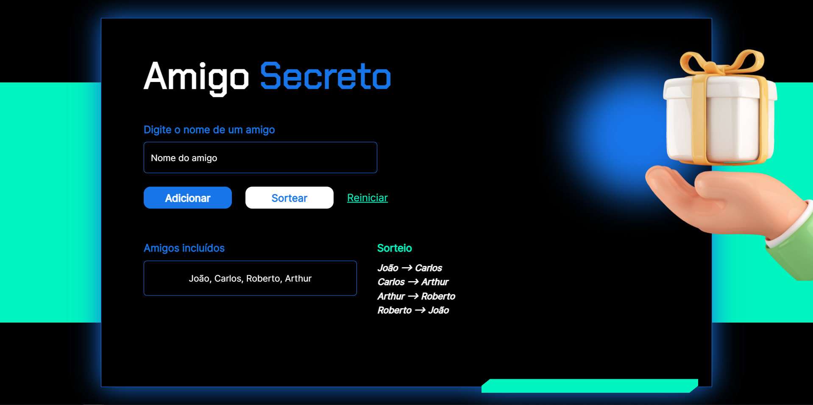

## Visão Geral

### O projeto

- Fazer um site de amigo secreto que seleciona aleatoriamente quem pegou quem dos que foram adicionados a lista

### Screenshot

### Links

- Live Site URL: [Amigo secreto](https://amigo-secreto-sigma-nine.vercel.app/)

## Meu processo

### Criado com

- JavaScript
- HTML e CSS fornecidos pelo curso

### O que eu aprendi

- Aprendi sobre pegar valor do input
- Usar um código criado pela comunidade para não deixar o atual selecionar o anterior
- Método toUpperCase() para deixar letras maiúsculas

## Autor

- GitHub - [João Metzdorf](https://github.com/joaometzdorf)
